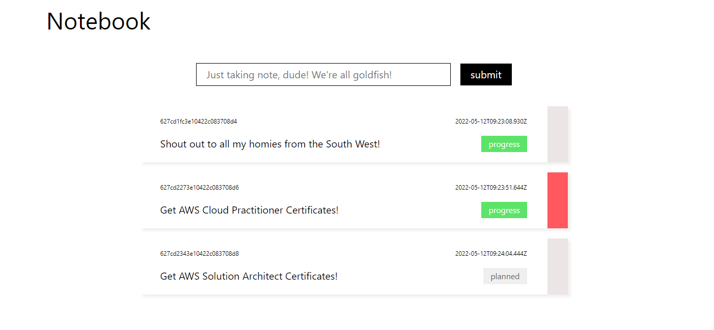
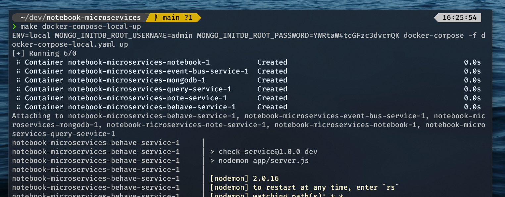
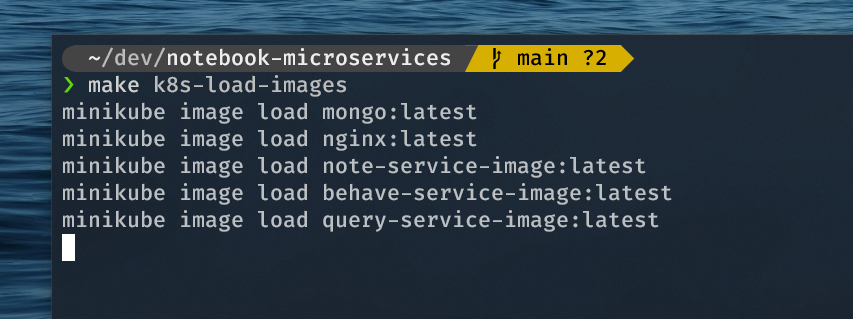
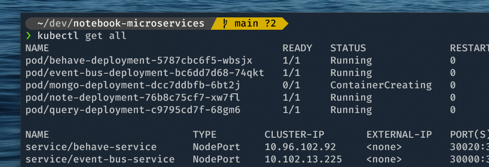

# NOTEBOOK MICROSERVICES



A taking note web application intergrated with Microservices architecture. My fist project implementing with `microservices architecture`, based on `event-drivent` technique for demonstration purpose. 
Thanks to this project I gained a lot of knowledges in the Microservices industry.

## Branchs
This repository contains 3 branches:
- Both the [main]() and [dev]() branches are for Docker development.
- The [k8s]() branch for Kubernetes development with Ingress technology.

## Prerequisites
You first need these tools to initialize this project:
- [Docker](https://docs.docker.com/engine/install/ubuntu/) an open platform for developing, shipping, and running applications.
- [Minikube](https://minikube.sigs.k8s.io/docs/start/) a virtual container for virtualizing a [Kubernetes](https://kubernetes.io/) cluster in [Docker](https://docs.docker.com/).
- [NodeJS](https://nodejs.org/en/) an open-source, cross-platform runtime for implementing JavaScript code.
- `Makefile` a special file, containing shell commands for the developing environment.

## `main` Branch Usage

### Clone
Clone the repository by using this command:
```bash
$ git clone https://github.com/shelldog/notebook-microservices.git && cd notebook-microservices
```

### Pull and Build Images
Build the images with this command:
```bash
$ make docker-pull-images   # pull prerequisite images first for faster & better usage

$ make docker-build-images  # build the entire images
```

### Run Locally Images
After building the images, run it locally by using this command:
```bash
$ make docker-compose-local-up  # run locally
$ docker ps   # show the running docker's container processes.
```



It's all done! You can now go into your browser and browse to the `http://localhost:3000`.

If you want to shut it down, gracefully use this command:
```bash
$ make docker-compose-local-down

$ make docker-rm-images

$ make docker-prune
```

### Run on Production
```bash
$ make docker-compose-production-up # run on production
$ docker ps
```
You can now go into `http://localhost`, cause' in the production the frontend must run on port `80`. If you want to shut down.
```bash
$ make docker-compose-production-down
```

## `k8s` Branch Usage

### Clone
Clone from `k8s` branch:
```bash
$ git clone -b k8s --single-branch https://github.com/shelldog/notebook-microservices.git && cd notebook-microservices
```

### Initialize Minikube
There are 2 ways to initialize the Minikube:
```bash
$ make k8s-init   # for Ubuntu OS environment.

$ make k8s-init-wsl2    # for WSL2 environment.
```

### Build & Load the Images



When you first build the images locally, the kubernetes cluster not actually receive those image! Run these command so the Minikube can receive it.
```bash
$ make docker-pull-images   # pull the prerequisite images.

$ make docker-build-images  # build the images.

$ make k8s-load-images      # minikube loads the images into the cluster.
```

### Run Locally



First of all you need to initialize the Secret and ConfigMap.
```bash
$ make k8s-up  # load the services.

$ make k8s-local-up   # run k8s locally.
```
Now you can access by browsing into the `http://localhost:3000`. To shut down the local Minikube, run these:
```bash
$ make k8s-local-down

$ make k8s-down
```


### Run Production
With production environment. You have to allow the Ingress service.
```bash
$ make k8s-up-ingress

$ make k8s-prod-up
```

Now you can access by browsing into the `http://localhost`. To shut down the production Minikube, run these:
```bash
$ make k8s-prod-down

$ make k8s-down
```

## LICENSE
[MIT](LICENSE)
